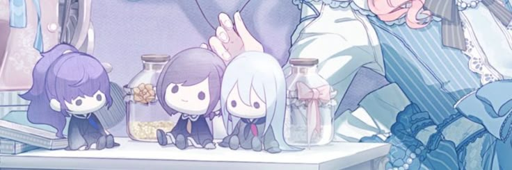

<!DOCTYPE html>
<header style="background-color:powderblue;">
  <h1>kiyomizuki.github.io | Kiyo's CT Projects :)</h1>
  
</header>
<body style="background-color:powderblue;">
 
  
<i>This was made for CT120: Intermediate Creative Coding. I have no idea if I did this right!</i>

 
  
<i>Hey! Do you have nothing better to do? Why not look at this and see the projects I've done in CT? Are they great? Meh, that's subjective.</i>

  
<i>Still, assignments are assignments at the end of the day :)</i>

  
<i>Go look at my projects, he says, waving his fist at the viewer...</i>

 
  <h1>CT20: Intro to Creative Coding (2025)</h1>
  

    
   
- <a href="https://kiyomizuki.github.io/Project1/index.html">Project 01</a>

   
- <a href="https://kiyomizuki.github.io/CreativeCode01/index.html">Creative Code 01</a>

   
- <a href="https://kiyomizuki.github.io/Project2/index.html">Project 02</a>

  <h2>CT120: Intermediate Creative Coding (2025)</h2>
  

   
- TBA

   
- TBA

   
- TBA

</body>
<footer>
  
Created by Sheer Willpower and Caffeine.

</footer>
</html>
